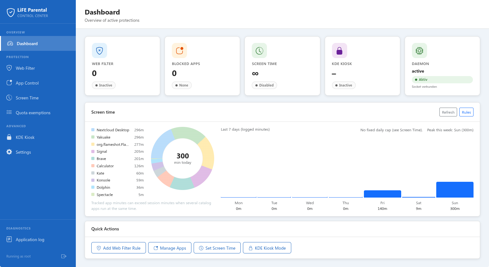

# LiFE Parental Control (`life-kiosk` repo, npm package `life-parental-control`)



Desktop app for **KDE Plasma (Linux)**: parental controls via **Electron**, **Vue 3**, **Pinia**, and **Bootstrap 5**. Kiosk restrictions use `.kiosk` profile snippets merged into `/etc/xdg/kdeglobals`.

## Modules

| Area | What it does |
|------|----------------|
| **KDE kiosk** | Lockdown sections in `kdeglobals` (actions, URLs, control modules); session restart after apply |
| **Web filter** | `webfilter.json` (custom domains + HaGeZi **feed** toggles) + `/etc/hosts` marker block; bundled [HaGeZi](https://github.com/hagezi/dns-blocklists) DNSMasq lists + optional CDN refresh (see below) |
| **Screen time** | `schedules.json`; cron → `/usr/local/bin/life-parental-check` (limits, allowed hours, overnight windows); daily tally in `usage-YYYY-MM-DD.json` (`extraAllowanceMinutes` raises today’s cap without altering logged minutes); reset **today** on the Screen Time page; **add time** via parent-password dialog when the limit is reached |
| **App blocking** | `.desktop` overrides under `/usr/local/share/applications/` (see below) |
| **App quotas** | `quota.json`; cron → `/usr/local/bin/life-parental-quota` (`pgrep` / `pkill` per process name); per-app tally in `quota-usage-YYYY-MM-DD.json` (reset **today** from **App Control**). The same cron increments **`app-usage-YYYY-MM-DD.json`** for every app in **`app-monitor-catalog.json`** (built from the same `.desktop` list as **App Control**; refreshed at app start and when you open **App Control**) so the Dashboard donut can show the **top 10** most-used catalog apps. Warnings (~5 / ~2 / final minute) and kills are issued by that script via `notify-send` and `kdialog` (not the Electron window). Optional **Quota exemptions** (`process-whitelist.json`): listed apps are **not** stopped when their daily quota is reached. |
| **Profiles** | School / Leisure + optional `life-modes.json`; backup/export JSON bundle |

**Config:** `/etc/life-parental/` (app expects elevated rights when packaged; see main process). Optional **`activity-log.json`** records parental actions (ring buffer); open it from the Dashboard via **Application log**, not part of backup export.

### Screen time: logged minutes

Logged minutes come from **`usage-*.json`** (one file per calendar day in `/etc/life-parental/`). While **daily limit** is enabled, the **root cron** adds **one minute per run** when **`loginctl`** shows a **graphical** session that is **active** or **online**, excluding **greeter** / **background** classes.

### App blocking (launcher)

Toggling **block** for an app creates a **desktop entry override** under `/usr/local/share/applications/` (`NoDisplay=true` so it disappears from the KDE launcher). The override replaces the launch command with a short notification so the user sees that the app is blocked instead of it starting.

### Daily time limits for individual apps (App Control)

Per-app daily cap: a **root cron** job runs **every minute**, counting minutes **while the process is running** (`pgrep -x -i`). With **daily limit ≥ 3**, at roughly **2 minutes** left you get a notification plus a light **`kdialog`**; at the **last minute** a stronger warning; on the **next run after that** the app is **stopped** if it is still running.

Default **process names** are derived from the desktop file’s **`Exec`** line (flatpak `--command=` / `run`, `snap run`, `sh|bash|dash|zsh -c …`, `electron` + flags, `*.AppImage` stem). If the live process name still differs (e.g. Steam titles, some AppImages), edit the **Process** field in the app so it matches the process **`comm`** (e.g. `ps -o comm`).

Counting only applies when the same **`loginctl`** rules as **Screen Time** apply: graphical sessions that are **active** or **online**, excluding **greeter** / **background** classes.

### Quota exemptions

Settings are stored in **`/etc/life-parental/process-whitelist.json`**. The app quota cron (**`/usr/local/bin/life-parental-quota`**) reads this file each run. For apps with a daily limit, if the limit is reached and the app is **not** exempt, it is stopped like before; exempt apps keep running. **Save** in the app updates the file and re-deploys the quota script (and removes any legacy **`life-parental-kill`** cron from older versions).

### Web filter: custom domains, HaGeZi lists, and `/etc/hosts`

**Source project:** [hagezi/dns-blocklists](https://github.com/hagezi/dns-blocklists) (GPL-3.0). LiFE ships **DNSMasq-formatted** snapshots under `hagezi/*.txt` (also packaged into `resources/hagezi/`). They use lines like `local=/example.com/`; the app converts domains to `0.0.0.0` lines in **`/etc/hosts`**.

**On startup** the app tries to refresh those files from jsDelivr (HTTP conditional request). Newer `# Version:` headers replace the copy under **`/etc/life-parental/blocklists/`**. If the machine is **offline** or the CDN returns **304**, the **last downloaded** or **bundled** snapshot is used.

**CDN list URLs** (same files as the bundle; `@latest` tracks the repo default branch):

| Topic | URL |
|-------|-----|
| Social networks | [`…/dnsmasq/social.txt`](https://cdn.jsdelivr.net/gh/hagezi/dns-blocklists@latest/dnsmasq/social.txt) |
| NSFW | [`…/dnsmasq/nsfw.txt`](https://cdn.jsdelivr.net/gh/hagezi/dns-blocklists@latest/dnsmasq/nsfw.txt) |
| Fake / scams | [`…/dnsmasq/fake.txt`](https://cdn.jsdelivr.net/gh/hagezi/dns-blocklists@latest/dnsmasq/fake.txt) |
| Gambling | [`…/dnsmasq/gambling.txt`](https://cdn.jsdelivr.net/gh/hagezi/dns-blocklists@latest/dnsmasq/gambling.txt) |
| Anti-piracy | [`…/dnsmasq/anti.piracy.txt`](https://cdn.jsdelivr.net/gh/hagezi/dns-blocklists@latest/dnsmasq/anti.piracy.txt) |
| Pop-up ads | [`…/dnsmasq/popupads.txt`](https://cdn.jsdelivr.net/gh/hagezi/dns-blocklists@latest/dnsmasq/popupads.txt) |

**Autostart (optional):** Adds or removes **`/etc/xdg/autostart/org.tuxfamily.life-parental-control.desktop`** so LiFE launches when you log in to the graphical desktop. Use **Settings → Startup** to toggle. Only the **packaged** app (deb/AppImage) can use this; the app must run **as administrator (root)** so it can write under `/etc/`—the development build cannot enable autostart from the UI. After the **first parent password** is set, autostart is enabled automatically when those conditions hold. Toggle off in Settings to remove the file again.

**Config:** `/etc/life-parental/webfilter.json` stores **`entries`** (custom domains shown in the UI), **`feedState`** (which HaGeZi lists are enabled), and **`listAllowlist`** (hosts that must never be blocked). The **live** block in **`/etc/hosts`** is `(enabled custom domains ∪ feed domains) \ allowlist` (deduplicated). Category lists are too large to edit line-by-line in the UI; use **Allow exceptions** on the Web Filter page to permit individual hosts. **Apply Changes** saves custom-domain edits; allowlist and feed toggles apply immediately when changed.

**Quick Add Categories:** **Domain packs** (e.g. Video Streaming, Gaming) add curated hostnames to **custom domains** in the UI. **HaGeZi lists** merge the full blocklist for each enabled topic into the LiFE block in **`/etc/hosts`** (bundled snapshots). **Update lists** (next to *HaGeZi lists* in the sidebar card) hits the same CDN refresh as app startup, then reapplies the mirror to `hosts`.

**Restore from saved rules** reads **`webfilter.json` only**, rebuilds the hosts block, and refreshes the UI (drops unsaved UI-only edits). If `/etc/hosts` is unreadable, the Web Filter page still loads from `webfilter.json` and shows a warning.

**Limits:** Large lists inflate `/etc/hosts`; DNS / DoH bypass or another resolver can still evade host-based blocking—see e.g. [school DNS discussion (linuxmuster.net)](https://ask.linuxmuster.net/t/wie-dns-server-einstellungen-fuer-kinderschutz-aendern/12089/2) for network-level ideas.

### Session restart (KDE)

After writing kiosk restrictions to `/etc/xdg/kdeglobals`, the app triggers a Plasma session restart: `kquitapp6|5 ksmserver` first, then `qdbus` logout on **each** relevant `loginctl` session (**x11** / **wayland**, **active** or **online**, excluding **greeter** / **background** classes) on that user’s session bus (`/run/user/<uid>/bus`), then the same DBus calls as root as a last resort. Typical single-seat setups work out of the box; edge cases may still need a manual re-login.

Screen-time and app-quota cron jobs use the same session filter when detecting logged-in graphical users (redeploy scripts after upgrading the app).

## Development

Requires **Node ≥ 22** and **npm ≥ 10**.

```bash
npm install
npm run check   # lint + compile (out/; no AppImage/deb, no dev server)
npm run dev
```

Enforcement features touch system paths. **`npm run dev`** (alias **`npm run dev:root`**) runs the Vite/Electron dev stack under **`sudo`** with a **small env whitelist** (display, session DBus, locale)—not **`sudo -E`**, so paths from e.g. an **IDE AppImage** terminal (`/tmp/.mount_…`) are not leaked into root’s Electron (avoids **dconf** / **DBus** spam and permission errors). **`XDG_RUNTIME_DIR`** is set to **`/run/user/$(id -u)`**. Starting **`electron-vite dev`** without root exits immediately with a dialog (the app persists config under **`/etc/life-parental/`**). **Packaged** builds show an elevation window, then **`pkexec`** when not root. **Settings → About → Running as** reflects the real user id (warning if you are not root). On first root start after an upgrade, `/etc/life-parental/.embedded-enforcement-version` triggers a one-time redeploy of screen-time and app-quota cron scripts so embedded Python matches the installed version.

### Polkit (Administrator prompt)

- **`.deb` install:** [`packaging/debian/postinst.sh`](packaging/debian/postinst.sh) copies [`packaging/polkit/org.tuxfamily.life-parental-control.policy`](packaging/polkit/org.tuxfamily.life-parental-control.policy) and [`packaging/polkit/50-org.tuxfamily.life-kiosk.rules`](packaging/polkit/50-org.tuxfamily.life-kiosk.rules) into `/usr/share/polkit-1/actions/` and `/usr/share/polkit-1/rules.d/`, then reloads **polkit** if possible. The rule maps **`pkexec`** invocations whose command line contains **`life-parental-control`** (deb binary) or **`life parental control`** (default AppImage/product title), **case-insensitive**, to **admin** authentication.
- **AppImage:** copy the same two files from `packaging/polkit/` to those system paths manually if you do not use the `.deb`. If you rename the binary or AppImage to something that no longer matches those substrings, adjust the rule locally or rely on the distribution’s default **PolicyKit** behaviour.

**Production build:**

```bash
npm run build   # runs electron-builder with --publish never (no GH_TOKEN needed locally/CI)
```

### Backup (import / export)

Settings in the app export **version 1** JSON (no password, no usage history). Includes **`processWhitelist`** (quota exemptions) when present. A minimal valid shape is in **`examples/life-parental-backup-v1.example.json`**. On import, only **top-level keys present** in the file are applied; omitted keys leave the existing system config untouched.

**CI:** `.github/workflows/ci.yml` runs **`npm run check`** on every **pull request** and on **push to `main` or `master`**. **Packaging:** `.github/workflows/package.yml` runs **`npm run build`** on **`workflow_dispatch`** or when a **`v*`** tag is pushed (uploads `dist/` as an artifact). **Dependabot** (`.github/dependabot.yml`) proposes monthly npm and GitHub Actions updates.

Authoring conventions and stack notes: root **`claude.md`** and **`memory.md`**.

### Troubleshooting

| Topic | Hint |
|-------|------|
| **App quotas / `pgrep` does not see the game** | Enforcement uses the **`comm`** name (`pgrep -x -i`), not the window title. AppImages may report `AppRun` or a wrapper; Steam often spawns another binary—set the **process name** manually on **App Control** (see **Daily time limits for individual apps** above). |
| **Window closes after “Weiter” / Polkit** | As a normal user you first see a small **elevation** window; **`Weiter`** runs **`pkexec`**, then this instance exits. If nothing else appears, check stderr for **`[LiFE Parental Control] pkexec relaunch failed:`** — ensure **`polkit`** and a PolicyKit agent are installed (`pkexec` in `PATH`). |
| **`pkexec` / Polkit after renaming the AppImage or install path** | The shipped rule matches **`life-parental-control`** or **`life parental control`** in the `pkexec` command line (case-insensitive). If your path/name omits both, symlink/rename or edit [`packaging/polkit/50-org.tuxfamily.life-kiosk.rules`](packaging/polkit/50-org.tuxfamily.life-kiosk.rules) and install it under `/usr/share/polkit-1/rules.d/`. |
| **Kiosk / session restart oddities** | Rare stale `loginctl` sessions or multi-seat setups may need a **manual re-login**; the app already skips greeter/background sessions and tries per-user then root `qdbus` logout. |
| **`NODE_OPTIONS` warning when starting AppImage/deb** | Old builds or a fuse-disabled binary: **rebuild** with current `electron-builder.yml` (`electronFuses` → packaged app ignores `NODE_OPTIONS`). **`npm run dev`** already strips `NODE_OPTIONS` for the dev server. |
| **DBus / `NameHasOwner` when `npm run dev`** | Same from a normal **Konsole**: Electron runs **as root** on **your** session bus; Chromium logs failed D-Bus probes sometimes. Usually **safe to ignore** if the UI works. **`npm run dev`** forces **`DBUS_SESSION_BUS_ADDRESS=unix:path=/run/user/$(id -u)/bus`**. (An AppImage IDE terminal can add *extra* env noise; root+Chromium is the main source.) |
