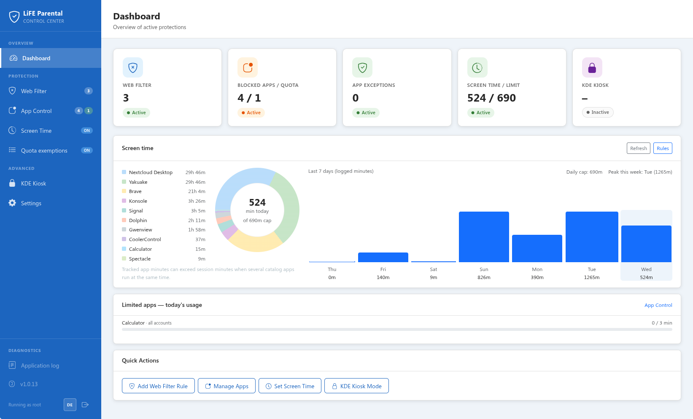
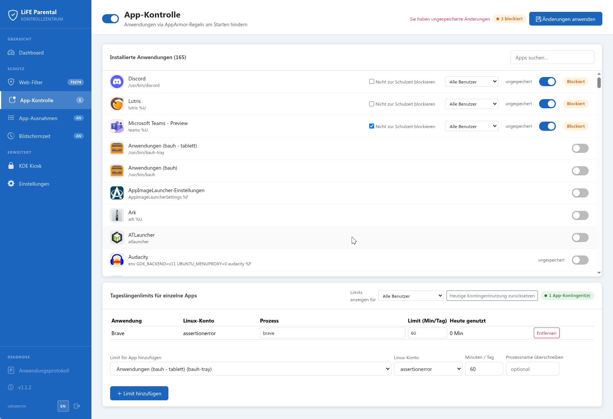
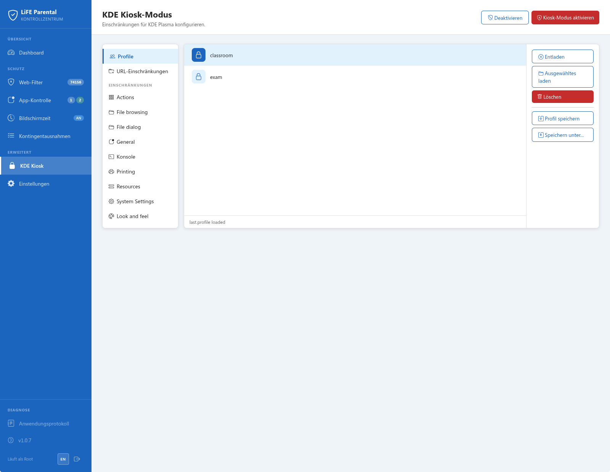
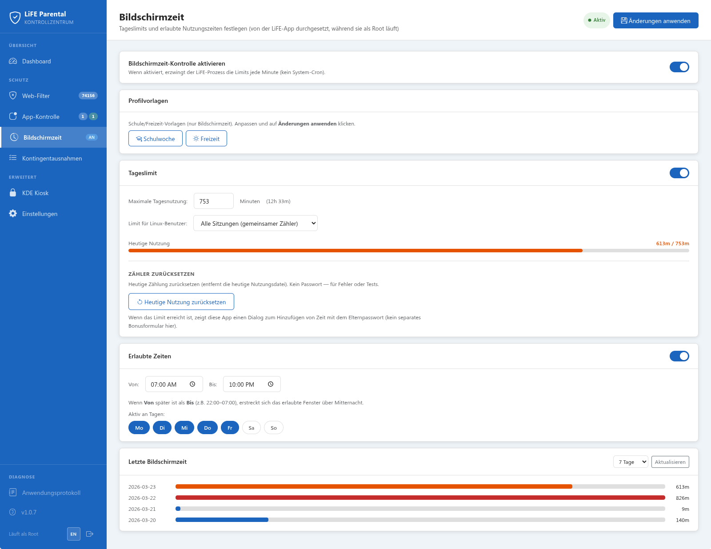
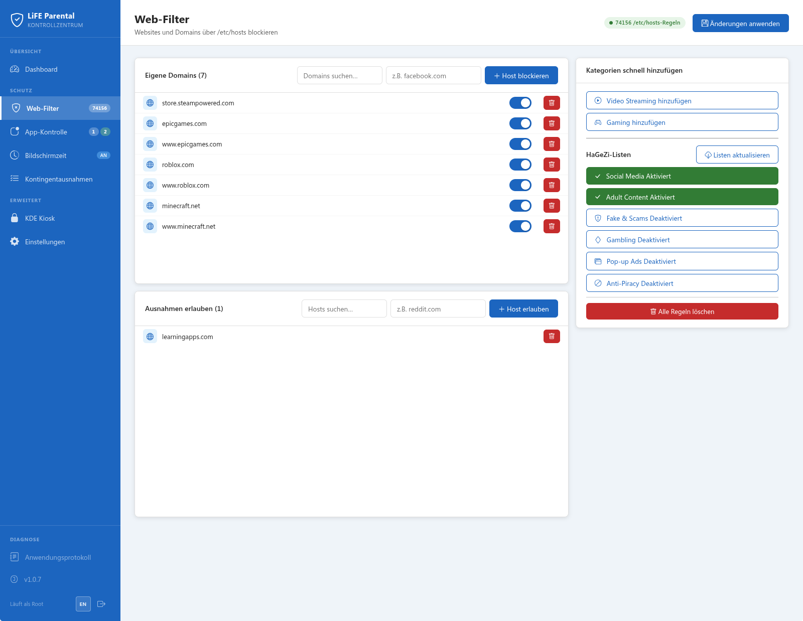
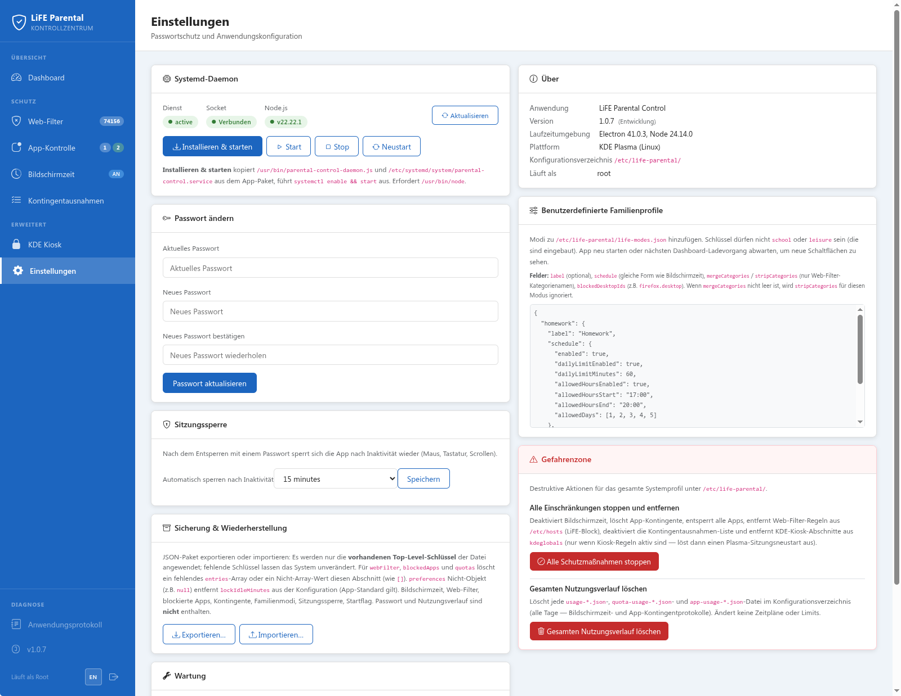
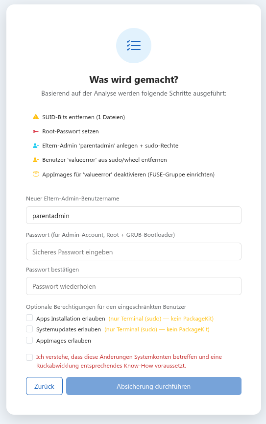

# LiFE Parental Control



Desktop parental control app for **Linux** (KDE Plasma, GNOME, others). Stack: **Electron**, **Vue 3**, **Pinia**, **Bootstrap 5**. Runs as root via systemd daemon; frontend runs as normal user.

## Features

| Module | Description |
|--------|-------------|
| **Lockdown Wizard** | First-run wizard: creates parent admin, sets root password, de-privileges child account; optional GRUB password and optional AppImage/FUSE restriction |
| **Web filter** | Custom domains + HaGeZi blocklists written to `/etc/hosts`; DNS-based filtering via **dnsmasq** (rewrites blocked domains to `0.0.0.0`); allowlist; category packs; optional **DNS4EU** family-safe upstream resolver; DHCP-discovered DNS used as fallback; optional **DoH hardening**: block known public DNS-over-HTTPS resolver IPs via **iptables** / **ip6tables** (toggle in the Web Filter UI; stored as `webfilter.dohIptablesEnabled` in `default.json`) |
| **Screen time** | Daily limit + allowed hours (overnight windows supported); quick presets (e.g. school week / holidays) on the Schedules page; bonus minutes via parent password; one-time parent bypass for allowed-hours enforcement |
| **School times** | Per-weekday from/to times edited under **Settings**; stored in `default.json` as `schoolTimes`; used by the daemon (e.g. **App blocking** can allow specific blocked apps during school hours via `allowAtSchoolTime`) |
| **App blocking** | The **daemon** kills processes when a blocked app runs for the configured user (process match / per-app rules). The user sees a **`notify-send`** that parental controls blocked the app |
| **App quotas** | Per-app daily cap; process tracking via `pgrep`; **quota exemptions** (whitelist UI: e.g. “Quota exemptions” / app-specific exemptions): exempt apps keep the session alive beyond the daily screentime limit as long as they are actively used — logout is deferred until the user is inactive in the exempt app for the grace period |
| **KDE kiosk** | Restrictions via `/etc/xdg/kdeglobals`; optional Plasma layout hard lock |
| **Dashboard** | Live overview of today's screen time usage (daily total + per-app breakdown); activity log with historical session and enforcement events |
| **Backup** | Export/import JSON bundle (v1); excludes password and usage history |

## Configuration files

| File | Purpose |
|------|---------|
| `/etc/life-parental/default.json` | All settings (schedule, webfilter, quotas, etc.). **Can be pre-filled and distributed** — the systemd daemon reads it on every tick and applies changes automatically. |
| `/etc/life-parental/auth.json` | Parent password hash (`sha256(password + salt)`). Root-only (`chmod 600`). Kept separate from `default.json` so settings can be distributed without exposing the password hash. **Can be pre-filled for rollouts** — see below. |
| `/var/log/life-parental/activity.json` | Activity log (ring buffer). Not included in backup export. |
| `/var/log/life-parental/daemon.log` | Daemon runtime log. |

### Distributing settings via `default.json`

Drop a pre-configured `default.json` into `/etc/life-parental/` before first start (e.g. via Ansible, deb postinst, or manual copy). The daemon picks it up automatically — no UI interaction needed to apply schedules, web filter rules, or quotas.

### Pre-setting a parent password for rollouts

To deploy with a pre-defined parent password, drop an `auth.json` into `/etc/life-parental/` before the daemon starts:

```json
{
  "passwordHash": "<sha256(password + salt)>",
  "salt": "<random hex string>"
}
```

Generate the hash with any shell:

```bash
SALT=$(openssl rand -hex 16)
HASH=$(echo -n "yourpassword${SALT}" | sha256sum | awk '{print $1}')
echo "{\"passwordHash\": \"${HASH}\", \"salt\": \"${SALT}\"}"
```

Place the output as `/etc/life-parental/auth.json` with `chmod 600` and `chown root:root`. The daemon will not overwrite an existing `auth.json` on startup.

## Lockdown Wizard

Appears on first unlock after installation. Guides the parent through:

1. Select child user to restrict
2. Create (or select existing) parent admin account
3. Set root password (optional: GRUB bootloader password)
4. De-privilege child: remove from sudo/wheel, strip supplementary groups, remove SSH keys, restrict FUSE/AppImages
5. Optional: allow child to install apps or run system updates

The wizard can be skipped and will reappear on the next unlock.

### Lockdown script (`/usr/bin/life-parental-lockdown`)

Installed automatically when you click **Install daemon** in Settings, or via the `.deb` postinst. Can also be run manually as root:

```bash
sudo /usr/bin/life-parental-lockdown <targetUser> <adminUser> <password|pwFile> <grubHash> [allowInstall] [allowUpdate] [protectGrub] [restrictAppImages]
```

| Argument | Description |
|----------|-------------|
| `targetUser` | Child account to de-privilege |
| `adminUser` | Parent admin account (created if not existing) |
| `password\|pwFile` | Plain password string **or** path to a temp file containing it |
| `grubHash` | Pre-computed `grub.pbkdf2.sha512…` hash (generate: `grub-mkpasswd-pbkdf2`) — leave empty to skip GRUB |
| `allowInstall` | `true` to allow package installation (PolKit + sudoers) |
| `allowUpdate` | `true` to allow system updates (PolKit + sudoers) |
| `protectGrub` | `true` to enable GRUB password step; `false` to skip it |
| `restrictAppImages` | `true` to restrict AppImages/FUSE for the child user; `false` to skip this step |

Example (manual, no GRUB, no AppImage restriction):
```bash
sudo /usr/bin/life-parental-lockdown student parentadmin "MyPassword" "" false false false false
```

## Development

Requires **Node ≥ 22**, **npm ≥ 10**.

```bash
npm install
npm run check   # lint + compile
npm run dev     # runs under sudo (display/session env forwarded)
```

The frontend runs as a normal user — no root required. `pkexec` is only used for two operations: **installing/managing the systemd daemon** and **running the Lockdown Wizard script**.

**First run in dev:** click **Install daemon** in Settings → this copies the systemd service, polkit rules, and lockdown script to their system paths.

### Polkit

The rule in `packaging/polkit/50-org.tuxfamily.life-parental-control.rules` authorizes `pkexec` calls whose command line contains `life-parental-control` or `life parental control` (case-insensitive). Installed to both `/etc/polkit-1/rules.d/` and `/usr/share/polkit-1/rules.d/` (Arch/Garuda).

`.deb` install handles this via `packaging/debian/postinst.sh`. For AppImage: click **Install daemon** in Settings.

### Build

```bash
npm run build   # electron-builder --publish never
```

CI: `.github/workflows/ci.yml` (lint + compile on PR / push to main). Packaging: `.github/workflows/package.yml` (on `v*` tag or `workflow_dispatch`).

## Screenshots








## Links

[](https://hypercommit.com/life-parental-control)
